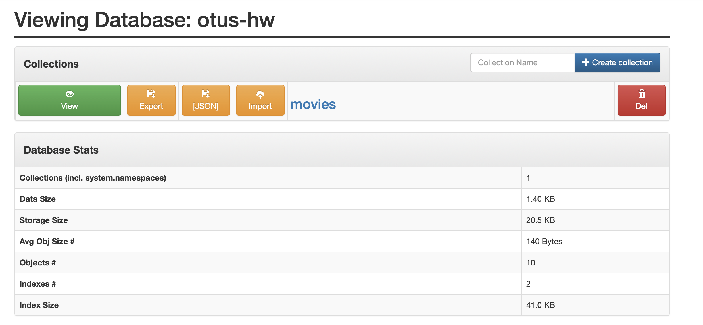
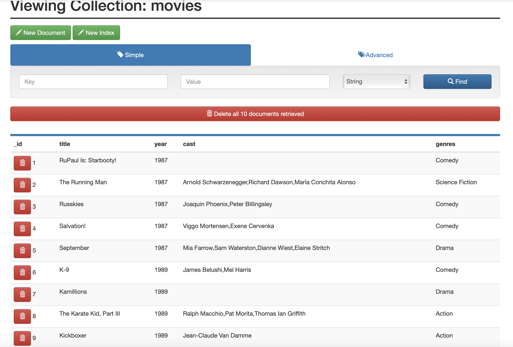
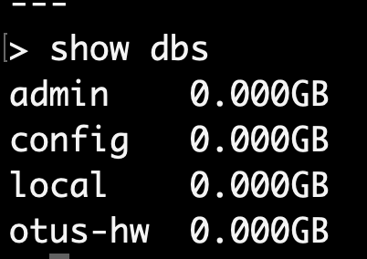
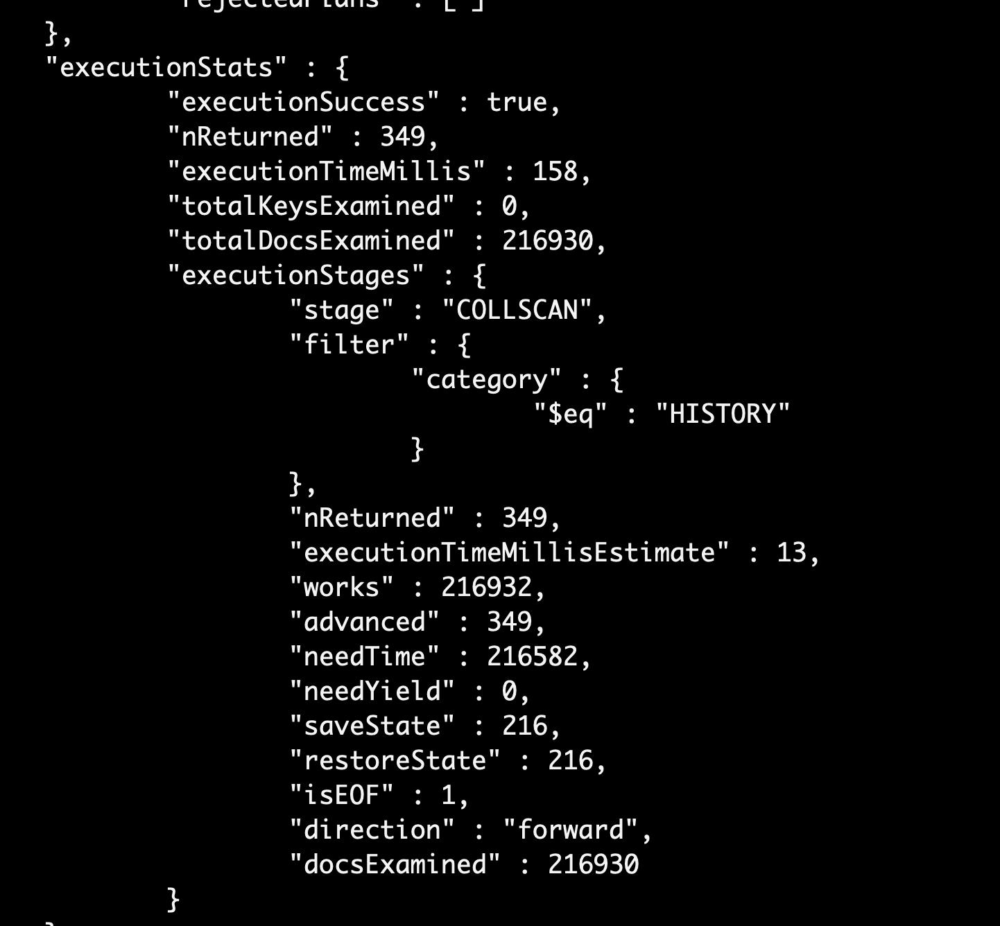
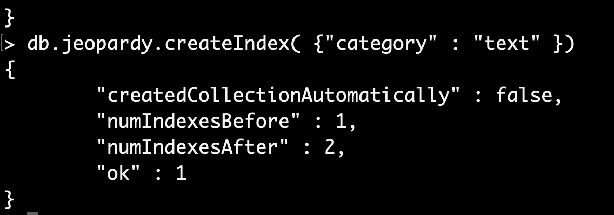
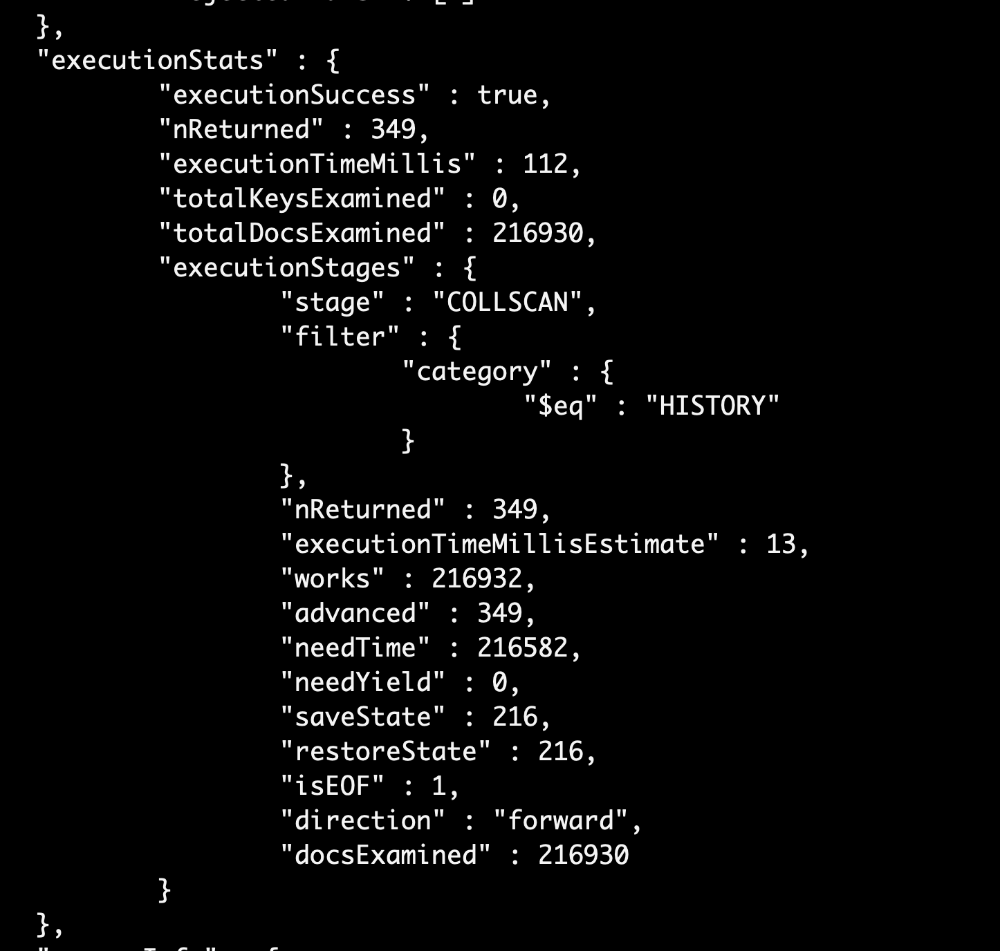

### Домашняя работа №2: MongoDB

- Для развёртывания MongoDB я использовал доккер.
- Инициировал БД и сразу наполнил её данными через файл [init.js](mongo-init/init.js), создав коллекцию movies и сделав построчную вставку записей из файла, приложенного к уроку.

Скриншоты из Mongo Express:

- Затем вошёл в командную строку доккер-контейнера

- Выполнил команду show dbs

- Затем сделал вставку ещё 6 записей из файла с командами, прикреплённого к уроку

- Сделал несколько запросов на поиск данных

- Сделал несколько запросов на обновление данных

## Создание индекса и оценка производительности поска в MongoDB

Для данной задачи я использовал датасет jeopardy. Сначала загрузил его на локальную машину, а затем скопировал в контейнер с mongo. После чего импортировал данный датасет в базу данных.

Посмотрев на пять строк из данного датасета, я подумал, что можно было бы посмотреть на производительность поиска по категории. 

Я измерил производительность, добавив метод *.explain("executionStats")* к своему поисковому запросу. Результат поиска по категории бех индекса выдал следущую информацию. 

После, я создал индекс.

Такой же поисковый запрос выдал уже следующую информацию. 

Как можно видеть, поиск по проиндексированной категори стал быстрее.
